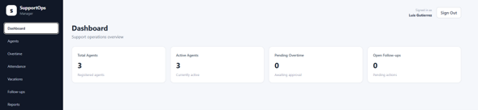
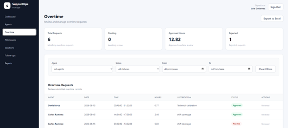
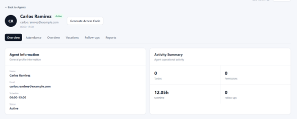

# SupportOps Manager

A full-stack support operations management platform designed to centralize common team-lead and support-management workflows.

SupportOps Manager provides administrators with tools to manage agents, attendance records, overtime requests, time-off history, follow-ups, documentation, and operational records, while also providing agents with a separate portal for submitting overtime requests.

## Features

### Administration

- Operations dashboard
- Agent management
- Individual agent profiles
- Attendance tracking
- Overtime request review and approval
- Overtime reporting and Excel export
- Time-off and vacation history
- Coaching and follow-up records
- Performance and administrative documentation
- PDF and image attachments
- Secure agent access-code generation

### Agent Portal

Agents have a separate authenticated portal where they can:

- Sign in using an individual access code
- View their profile information
- Submit overtime requests
- Track the status of submitted requests

Agent and administrator permissions are separated at API level.

## Screenshots

### Dashboard



### Overtime Management



### Agent Profile




## Technology Stack

### Frontend

- React
- Vite
- JavaScript
- CSS

### Backend

- Python
- FastAPI
- SQLAlchemy
- Pydantic
- JWT authentication

### Database & Infrastructure

- PostgreSQL
- Alembic database migrations
- Docker Compose

## Security

The application includes several server-side security controls:

- Role-based authorization for administrators and agents
- JWT access tokens with expiration
- Hashed administrator passwords
- Hashed agent access codes
- Server-side overtime calculations
- Protected administrative endpoints
- Restricted state transitions for overtime and follow-ups
- File upload size restrictions
- MIME-type validation
- File-signature validation for PDF, PNG and JPEG uploads
- Randomized internal attachment filenames
- Protected attachment retrieval

Sensitive configuration such as JWT secrets and database credentials is excluded from version control.

## Main Modules

| Module | Purpose |
| --- | --- |
| Dashboard | Operational overview and team metrics |
| Agents | Agent registration and management |
| Agent Profile | Centralized individual agent history |
| Attendance | Attendance event tracking |
| Overtime | Submission, approval, rejection and reporting |
| Time Off | Historical vacation and leave records |
| Follow-ups | Coaching and performance follow-up tracking |
| Reports | Administrative records and supporting attachments |
| Agent Portal | Restricted self-service portal for agents |

## Architecture

```text
React / Vite
     |
     | HTTP / JSON
     v
FastAPI
     |
     | SQLAlchemy
     v
PostgreSQL

Database schema changes
     |
     v
Alembic

Authentication and authorization are enforced by the FastAPI backend rather than relying exclusively on frontend controls.

Running the Project
Requirements
Python 3
Node.js
PostgreSQL
Docker / Docker Compose
Database

Start the PostgreSQL container from the project root:

docker compose up -d
Backend
cd backend


python -m venv .venv


# Windows
.venv\Scripts\activate


pip install -r requirements.txt

Create a .env file inside backend containing the required environment configuration.

Run database migrations:

alembic upgrade head

Start the API:

uvicorn app.main:app --reload
Frontend

From another terminal:

cd frontend
npm install
npm run dev

The Vite development server will provide the local frontend address.

Project Status

Version 1.0

Core functionality, authentication, operational workflows and production frontend build have been completed.

Author

NewSteppenwolfCR

GitHub: NewSteppenwolfCR